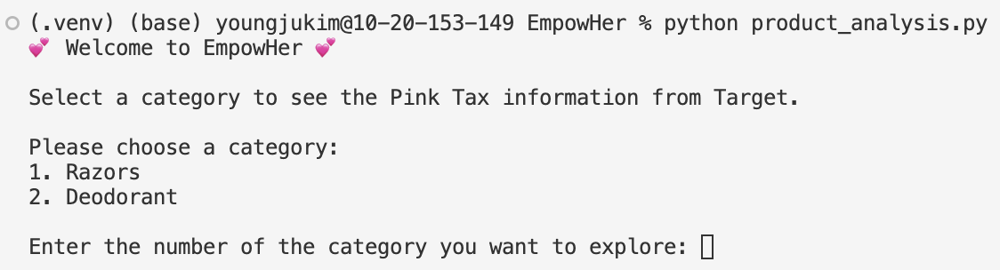
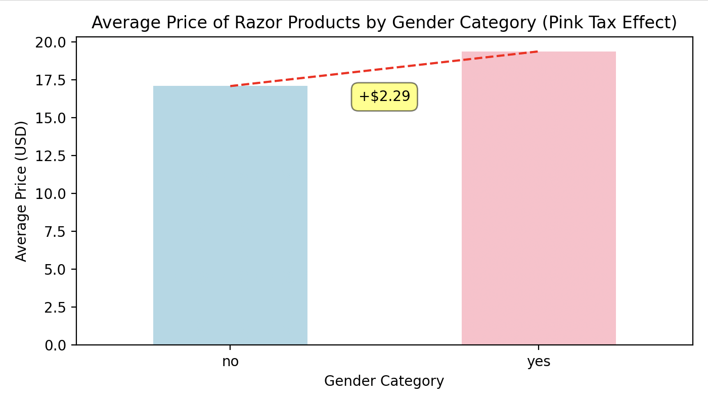

# 🎀 `EmpowHer`: Pink Tax Analysis 💸

## ✨ Description

Welcome to the `EmpowHer`, a program where you can learn more about **Pink Tax**!✨ If you've never heard about Pink Tax, it's basically the extra cost added to products marketed to women, even when they are nearly identical to men's. 😤 This project was created to help expose those price differences. By analyzing the prices of men's and women's personal care products, we break down the differences using web-scraping, color analysis (think *pretty-in-pink* 🌸), and good old data visualization! 📊

The core features include:

- **Data Scraping**🕵️‍♀️ : `Selenium` is used to scrape Target for product info like names, brands, prices, and images. If you'd like, you can un-comment the code starting from **line 150** in `main.py` to scrape other options like shampoo and deodorant. In case you’re not in the mood to wait ⏳ for the scraping process, I've already create a sample database using the **razors** option 🪒 . 
- **"Girly" Color Detection**: Using Clarifai’s API, we check if a razor’s packaging or design screams *girly* by looking for color shades of pink, purple, or red.
- **Price Analysis**: When razor prices come in ranges, we calculate the average and show a visual representation of price disparities between girly and non-girly razors. 🛒


## 🧪 Dependencies

To use `EmpowHer`, you'll need a couple of things:

- **Clarifai API**: This is what makes the magic happen when it comes to color detection! 🌈 If you don’t have a *Clarifai* account yet, go create one at [Clarifai Explore](https://clarifai.com/explore) and grab yourself a **Personal Access Token** from the *Security Tab* under your account settings. 🔐

  **Note**: On the free *Community Level Subscription*, you get **1,000 API calls per month**. 🆓 That’s was more than enough for me when I tested out all the options but if you want to use it on a larger database that exceeds 1000 rows, you'll have to upgrade to a paid subcription tier 😭

- **Selenium**: 🕸️ To scrape the product data from Target.
- **Pandas** & **Matplotlib**: For all things data wrangling and visualization. 🐼

Make sure to check the `requirements.txt` file to get everything installed smoothly. 🛠️


## 💻 Installation

Let’s get you started! 🚀 Follow these steps to set everything up:

1. **Clone the repo** to your local machine:
   ```bash
   git clone https://github.com/jk021227/EmpowHer.git
   cd repository
   ```

2. **Create a virtual environment**:
   ```bash
   python -m venv .venv
   source .venv/bin/activate
   ```

3. **Install the necessary libraries**:
   ```bash
   pip install -r requirements.txt
   ```

4. **Create a `.env` file** with your personal access token from Clarifai! It should look like this:
   ```bash
   PAT=YOUR_PAT_KEY
   ```

   Replace `YOUR_PAT_KEY` with your actual PAT key. 🎟️ In case it's a bit confusing, think of a **PAT** key as the same as an **API** key.

## 🤏 How to run it from scratch

1. **Uncomment from line 145 onwards in `main.py`**
   - After uncommenting, run the following command in your terminal (make sure you're inside your virtual environment):
   ```bash
   python main.py
   ```

2. **Choose an option:**
   When you run the script, you'll see a welcome message in the terminal like this:

   ```plaintext
   💕 Welcome to Pink Tax 101 💕
   
   Have you ever heard about the 'Pink Tax'? 🤔
   It's that sneaky little extra charge applied to products marketed toward women, even though similar products for men often cost less. 😠
   
   Let's dive in and explore how much more women pay for basic items like razors, shampoo, and deodorant.
   
   You get to pick a category, and we'll show you just how real the Pink Tax is! 💸
   
   Ready to see the price differences? Let's start scraping! 🚀

   Pick a category:
   1. Shampoo
   2. Razors
   3. Deodorant

   Enter the number of the category you want to explore:
   ```

3. **Update file paths for the category you choose & run `python api.py` in terminal**
   - Modify **line 13** of `api.py` to choose the correct csv file generated by the web scraping, currently it is like this since I ran it for the 2nd option:
   ```python
   file_name = 'deodorant_products.csv'
   ```
   - Based on your selection, this will generate an `(option)_updated_file.csv` file. This file will have an added boolean column (`is_girly`) to the database.

4. **Run the analysis script**
   - So, I’ve already whipped up the databases for **razors** and **deodorant**, so the only option you probably scraped is the shampoo one. 🤔 *Totally not* because I ran out of API calls... *cough cough* 🙈.  
   - Open `product_analysis.py` and go ahead and **uncomment line 10** and **lines 30–33** to add shampoo as an option into the Pink Tax analysis. Now, run the analysis in your terminal:
   ```bash
   python product_analysis.py
   ```
   - Here is a sample walkthrough of what that would look like:
   
   
   
   
   🎉 Viola! You've now got the analysis and visuals on how the Pink Tax affects the chosen category.

5. Feel outraged 😡 or laugh nervously 😅 at the results. 

## 🔮 Purpose & Impact

`EmpowHer` will produce some pretty graphs (okay, maybe not *pretty*, but informative 👉 👈). It's an educational tool that can help people make more empowered consumers. It's important to not let these corporate giants overcharge you!


## 🛠️ Extensions

- 🌟 **More Product Categories**: Currently, it has only 3 categories, but those are just the ones that Pink Tax affects the most, you can extend the program with very minor tweeks to include research about other products as well. Maybe belts next❓